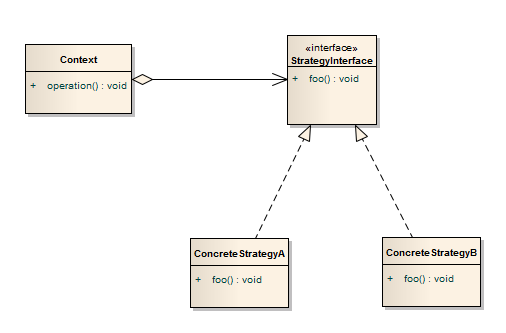

# Strategy pattern

Z algoritmy.net:

Návrhový vzor strategie (Strategy, Policy) slouží k vyměňování různých implementací algoritmu za běhu programu. Tato záměna může proběhnout buď explicitně (na žádost klienta) nebo implicitně (na základě nastavení ovladače).

Jádrem tohoto vzoru je třída Context, která slouží jako container na jednotlivé postupy. V momentě, kdy dojde k potřebě změny chování, Context prohodí objekty reprezentující dané algoritmy.

Mějme pokladnu v baru, pokladna (odpovídá Contextu) umí některé operace, které budou vždy stejné – například vytisknout účtenku, ale zároveň se její chování musí měnit v průběhu času, protože bar pořádá tzv. „Happy hour“, kdy zákazníci mají slevu 10% na jednotlivé nápoje. Z tohoto důvodu je vhodné implementovat chování slev pomocí návrhového vzoru strategie. Tímto se zároveň zajistí snadné přidání dalších akcí do pokladního systému (na vysvědčení pivo pro premianty zdarma atp.).

