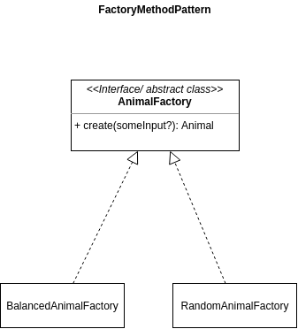
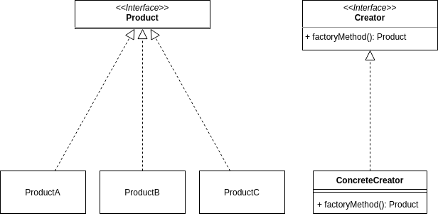
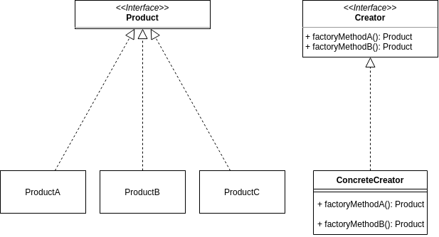
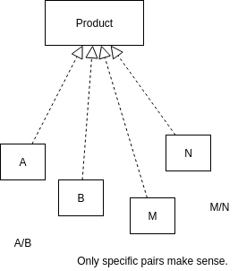
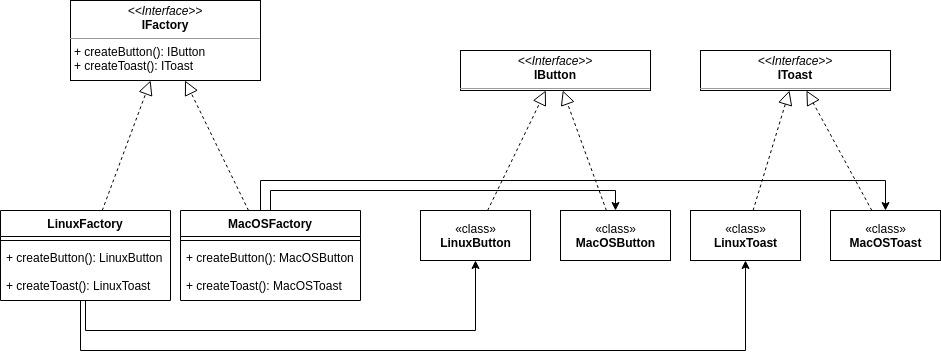

# Factory pattern

- Simple factory (not a pattern)
- Factory method pattern
- Abstract factory pattern

## Description
- Factory is responsible for instantiating classes.
- We can use it when complex logic is used to create an instance
- Useful when we have a switch case for class instantiation on multiple places in our app.
- Keeps the business logic of creation encapsulated in the factory.
- We can have multiple factories that create the same things, but in a different way.

## Example
- Classes `Cat`, `Dog`, `Duck` extend from `Animal`.
- We can have factories `RandomAnimalFactory`, `BalancedAnimalFactory`, etc.
  - Both will have the `create` method 
- `RandomAnimalFactory` won't have any state, it will randomly create `Animal` instance
- `BalancedAnimalFactory` will have state and will ditribute the occurences.

### Factory method pattern

### Abstract factory pattern
- any concrete factory can produce two+ products (see `factoryMethodA` and `factoryMethodB`).

- > for creating families of related or dependend objects
  - 
  - here we can say that `A,B` are MacOS and `M,N` are Windows. `A` and `M` would be a Button.
- useful when building UIs that need to be platform independent
    - e.g MacOS, Windows, Linux
    - let's say that 
    - 
